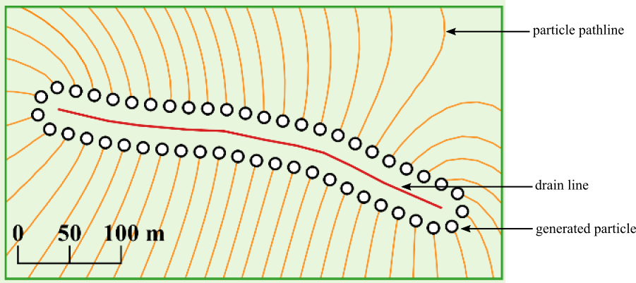
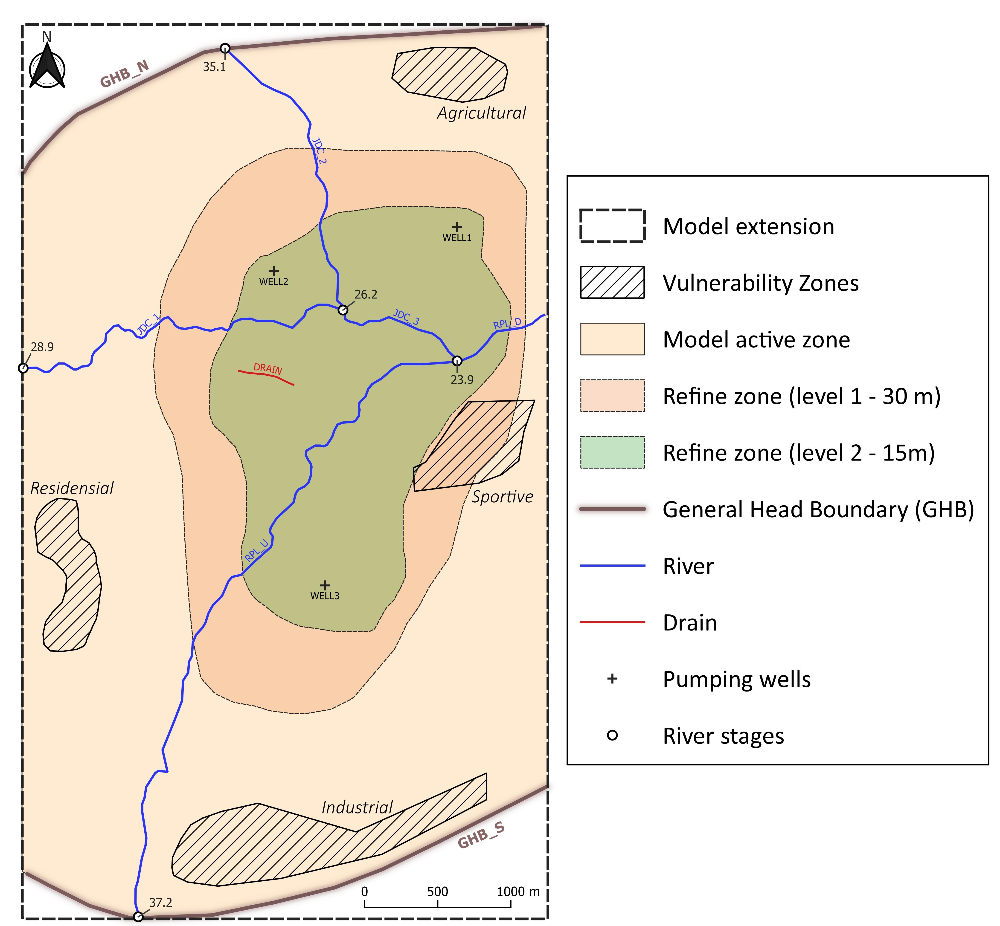

# From particle tracking to drinking water production facilities vulnerability
*Presentation, description and tutorials of a basic particle tracking tool in `python`. It provide simple pre- and post- processing classes/methods and functions over `flopy` module to manage water production facilities vulnerability from river or zonal source.*

### Required python packages
    - Numpy
    - Pandas
    - Shapely
    - Geopandas
    - FloPy
    - Matplotlib 
    - matplotlib_venn 

### Required executables
    - modflow6
    - modpath7
    - gridgen

The *Windows* version of these executables are available in the `exe/` folder.

### Main functionalities of the `vulnerability.py` tool

**Preprocessing:**

    - Generate/Seed particles from facilities locations (geometry or shapefile)
    - Merge, add, remove and extract usefull informations of generated particles
    - Combine generated particles with `flopy` and `Modpath7`

**Postprocessing:**

    - Perform river vulnerability for each production facility as a mixing ratio (quantitative method)
    - Perform river reaches aggregation
    - Perform zonal vulnerability from potential polluted zones (geometry or shapefile) as a mixing index (semi-quantitative method)
    - Manage particle pathlines multi-zonal intersections (with venn plot utility)

### Get started

**Generate particles**


```python
# ---- Import packages
import os
import flopy
from vulnerability import ParticleBuilder, ParticleMerger

# ---- Initiate ParticleBuilder instance (drain)
pb_drn = ParticleBuilder(name = 'DRAIN', gwf = gwf, shp_name = 'drain_line.shp')

# ---- Generate Particles
drn_part = pb_drn.gen_npart(dist=20, n_part=50, gen_type='around', fid='d1')
```

<p align="center">

</p>


**Set generated particles in `flopy` Modpath7 simulation**

```python
# ---- Extract particles data
dist = 15 #meters
well_df = pb_wells.get_particle_df(dist = dist, n_part = 1000)
drn_df =  pb_drns.get_particle_df(dist = dist, n_part = 1000)

# ---- Merge all particles data
pm = ParticleMerger([well_df, drn_df])

# ---- Build MODPATH7 ParticleGroup instances
particlegroups = [pm.get_ParticleGroup(fid = fid) for fid in pm.get_fids()]


# ---- Build MODPATH7 SIM package
mpsim = flopy.modpath.Modpath7Sim(mp, simulationtype='combined',
                                      trackingdirection='backward',
                                      weaksinkoption='stop_at',
                                      weaksourceoption='stop_at',
                                      particlegroups= particlegroups)
```

**Manage Steady-Stade river vulnerabilty calculating mixing ratios**

<p align="center">

</p>

```python
# ---- Import Steady-State River Vulnerability instance
from vulnerability import SSRV

# ---- Create SSRV object
ssrv = SSRV(gwf = gwf, mpsim = mpsim)
print(ssrv)
```
<p align="center">

</p>

```python
# ---- Aggregate some reaches
agg_dic = { 'JDC' : [reach for reach in ssrv.get_reach_names() if 'jdc' in reach],
            'RPL' : [reach for reach in ssrv.get_reach_names() if 'rpl' in reach] }

# ---- Compute mixing ratios (in %)
mr_df = ssrv.compute_mixing_ratio(agg_dic, filled = True) * 100
```

<p align="center">

</p>
