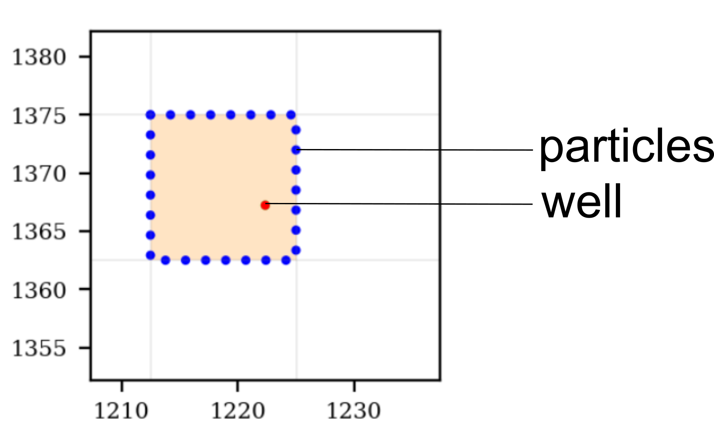
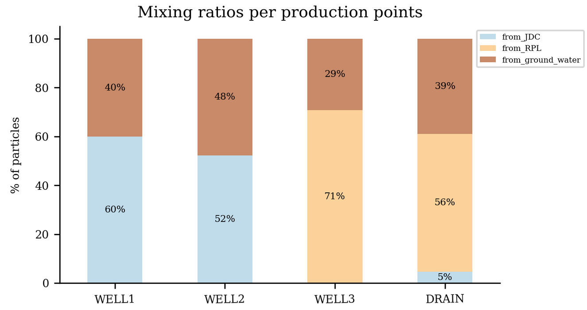

[](https://github.com)
[](https://www.python.org/)
[](https://github.com/Naereen/badges/)
[](https://github.com/Naereen/badges)

<H1 align="center"> 
TrackTools
</H1>


Description
-----------------------------------------------
*Presentation, description and tutorials of a basic particle tracking tool in `python`. It provide simple pre- and post- processing classes/methods and functions over `flopy` module to manage water production facilities vulnerability from weak sources.*


Requirements
-----------------------------------------------
*Python packages*

    - Numpy
    - Pandas
    - FloPy

*Executables*

    - modflow6
    - modpath7
    - gridgen

The *Windows* version of these executables are available in the `bin/` folder.


Overview
-----------------------------------------------
*Preprocessing:*

    - Generate/Seed particles from facilities locations (geometry or shapefile)
    - Merge, add, remove and extract usefull informations of generated particles
    - Combine generated particles with `flopy` and `Modpath7`

*Postprocessing:*

    - Perform weak sources (river) vulnerability for each production facility as a mixing ratio (quantitative method)
    - Perform river reaches aggregation


Get started
-----------------------------------------------

**Generate particles**


```python
# ---- Import tool
from tracktools import ParticleGenerator

# ---- Load simulation object
sim = flopy.mf6.MFSimulation.load(exe_name='mf6')

# ---- Load ModflowGwf model
gwf = sim.get_model('model')

# -----  Initialize ParticleGenerator instance 
pg = ParticleGenerator(ml = gwf)

# ---- Set number of particle to seed
n_part = 50

# ---- Generate particles around well cells (from nodes number)
pg.gen_points({'w1':1209, 'w2': 4586},  n= n_part)

# ---- Get list of FloPy ParticleGroups instances
particlegroups = pg.get_particlegroups(pgid_file='pgroups.csv')

```

<p align="center">

</p>


**Build Modpath7 simulation**

```python
# ---- Build MODPATH7 model instance
mp = flopy.modpath.Modpath7(modelname= 'mp', flowmodel= gwf, exe_name= 'mp7')

# ---- Set default iface for MODFLOW 6
defaultiface6 = {'RCH': 6, 'EVT': 6}

# ---- Build MODPATH7 BAS package
mpbas = flopy.modpath.Modpath7Bas(mp, porosity=0.1, defaultiface=defaultiface6)

# ---- Build MODPATH7 SIM package
mpsim = flopy.modpath.Modpath7Sim(mp, simulationtype='pathline',
                                      trackingdirection='backward',
                                      weaksinkoption='stop_at',
                                      weaksourceoption='stop_at',
                                      budgetoutputoption='no',
                                      stoptimeoption='extend',
                                      particlegroups= particlegroups)

# ---- Write modpath files
mp.write_input()

```

**Post-processing river vulnerabilty**


```python
# ---- Import Steady-State River Vulnerability instance
from tracktools import TrackingAnalyzer

# ---- Get TrackingAnalyzer instance
ta = TrackingAnalyzer(ml=gwf, mpsim=mpsim)

# ---- Compute mixing ratio
mr = ta.compute_mixing_ratio(on='river', edp_cell_budget = True, v_weight = True)


```
<p align="center">

</p>


Tutorial
------------------------------------------------
A quick and simple [tutorial](https://github.com/tracktools/tracktools/tree/master/synmodel) (jupyter notebook) performed on a synthetic model is provided to have a quick overview of `tracktools` library usage.


Contributing
------------------------------------------------

Bug reports, code contributions, or improvements to the documentation are welcome from the community. 
Feel free to suggest improvements by working with your own fork version of `tracktools`. Go to the Tracktools project page and hit the **Fork** button.
You will want to clone your fork to your machine:

    git clone <url_tracktools> <tracktools-yourname>
    cd tracktools-yourname


Ressources
-----------------------------------------------

+ [FloPy documentation (latest release)](https://flopy.readthedocs.io).
+ [MODFLOW and Related Programs](https://water.usgs.gov/ogw/modflow/)
+ [PEST++ - GitHub page](https://github.com/usgs/pestpp)
+ [PEST - homepage](http://www.pesthomepage.org/)
+ [pyEMU - GitHub page](https://github.com/pypest/pyemu)
